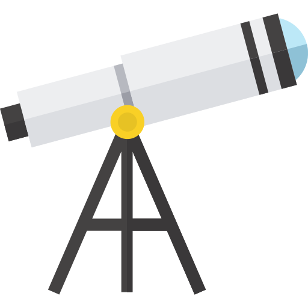

# Astronomy 101

<p class="emphase2"><strong>Introduction</strong></p>

***

**Topics**

***

<br>
<br>

:::::{div} full-width
::::{card-carousel} 4

:::{grid-item-card}
:class-header: bg-light
:margin: 3
**Introduction**
^^^

- **Difficulty**: 🟢 
- **Status**:  - 🔥
- **Needs**: 🏸 - 💏
- **Read time**: 5 min

<br>
<br>

<div class="wrapper">
<button class="button"><span> <a href="Astronomy_101.html"  title= "" target="blank"> Let's Go ! </a></span></button> 
</div>

:::

:::{grid-item-card}
:class-header: bg-light
:margin: 3
**Cosmic Inventory**
^^^

- **Difficulty**: 🟡 
- **Status**:  - 🔥
- **Needs**: 🏸 - 💏
- **Read time**: 5 min

<br>
<br>

<div class="wrapper">
<button class="button"><span> <a href="Sub_topics/Cosmic_inventory.html"  title= "" target="blank"> Let's Go ! </a></span></button> 
</div>

:::

:::{grid-item-card}
:class-header: bg-light
:margin: 3
**Historical Perspective**
^^^

- **Difficulty**: 🔴 
- **Status**:  - 🔥
- **Needs**: 🏸 - 💏
- **Read time**: 1h

<br>
<br>

<div class="wrapper">
<button class="button"><span> <a href="Sub_topics/History.html"  title= "" target="blank"> Let's Go ! </a></span></button> 
</div>

:::

:::{grid-item-card}
:class-header: bg-light
:margin: 3
**Anatomy of a telescope**
^^^

- **Difficulty**: 🟣 
- **Status**:  - 🔥
- **Needs**: 🏸 - 💏
- **Read time**: 5 min

<br>
<br>

<div class="wrapper">
<button class="button"><span> <a href="Sub_topics/Telescope_anat.html"  title= "" target="blank"> Let's Go ! </a></span></button> 
</div>

:::

:::{grid-item-card}
:class-header: bg-light
:margin: 3
**Space Missions**
^^^

- **Difficulty**: 🟡 
- **Status**:  - 🔥
- **Needs**: 🏸 - 💏
- **Read time**: 20 min

<br>
<br>

<div class="wrapper">
<button class="button"><span> <a href="Sub_topics/Missions.html"  title= "" target="blank"> Let's Go ! </a></span></button> 
</div>

:::


::::


<p class="emphase">&#10024; <br><br>The following image is unfortunately becoming a rarety for most of us</p>


```{figure} Docs/Milky_way_1.jpg
---
name: Telescopes_EM
width: 1200px
---
[source](https://apod.nasa.gov/apod/ap220611.html)
```

:::::


## Measuring the Universe

:::::{div} full-width
::::{grid} 2

:::{grid-item}

One of the most difficult thing, when doing Astronomy, is to obtain a **sense of scale**, because the dimensions involved are completely different to what we are used to on Earth. So lets expand our measuring scale beyond the standard International System of units (SI). Thre is 3 main parameters that we will look at, distances, pressure and temperature.

:::

:::{grid-item}
 
:::

::::

:::::


### Before to start

***
<h4><strong>Scales in space and time</strong></h4>

<article id="P1">

<div id="subdiv1-3">    


    

:::{grid-item-card}
:class-header: bg-light
:link: https://www.open.edu/openlearn/science-maths-technology/scales-space-and-time/content-section-0?active-tab=description-tab

```{figure} ../../Docs/Open_Learn_Images/Scales_in_space_and_time.jpg
:width: 300px
```
    
- **Time**: 12h course 
- **Level**: Introductory  

    
:::
    
</div>    
    
<div id="subdiv2-3">

Scale – *dealing with the miniscule to the massive, over milliseconds to millennia* – is central to all the sciences. In this free course, Scales in space and time, you’ll go to the absolute limits of what can be measured – all through a study of an oak tree! By studying it you will be introduced to concepts in physics, chemistry, biology and life-sciences, and Earth and environmental sciences. Across these multiple disciplines you will meet time scales that include ages, durations and rates, and size scales including distances in three dimensions, which underpin areas and volumes.
</div>
    

    
</article>

***


### Distances

[The entire length scale](https://www.htwins.net/scale2/)

#### Astronomical Units (AU)

- Sun-Earth distance = 149597871 km 

```{figure} Docs/Astrod.png
:width: 200px
Distances 
```

#### Parsec (pc)

#### unit angle (")

Because of telescopes ...

### Pressure

different pressure environment in the Universe

- Ultra High Vacuum (UHV)
    - [Youtube video](https://www.youtube.com/watch?v=XkKZ3W7kOo4)
    
    
- How do we measure pressure at UHV conditions ?
    - [Ion Gages](https://www.youtube.com/watch?v=VO0WV3FrDJQ)

### Temperature

- create python tool Kelvin/ Degree (Celcius)


### Othere quantities


#### The Sun

The Sun is a <strong>reference</strong>.


## Observing the Universe

There is different "method" to observe the universe:

:::::{div} full-width
::::{grid} 3
:::{grid-item-card}
:class-header: bg-light
<span style="float: right"> &#128064;</span>  With your own eyes
^^^

[Interactive sky chart](https://skyandtelescope.org/interactive-sky-chart/)

:::
:::{grid-item-card}
:class-header: bg-light
<span style="float: right"></span> Optical telescopes
^^^

[Stars 3D Map](https://charliehoey.com/threejs-demos/gaia_dr1.html)

GAIA mission

(Lots of stars)

:::

:::{grid-item-card}
:class-header: bg-light
<span style="float: right"></span> Multi-wavelength observations
^^^

[Chromoscope.net](https://chromoscope.net/)

:::
::::
:::::


::::{div} full-width
:::{dropdown} Telescopes

```{figure} Docs/Telescopes_EM.jpg
---
name: Telescopes_EM
width: 1200px
---
[source](https://hubblesite.org/contents/media/images/01FEBQTM8Y4FESTQ4N2AFQDBXH?itemsPerPage=100)
```

<p class="emphase">Explanation</p>

:::
::::

### Feel like practising ?

Check this `Open Learn` course made available for free by the Open University to get hands-on experience with a remote telescope (COAST) and produce your first astronomical image.   

***
<h4><strong>Astronomy with an online telescope </strong></h4>

<article id="P1">

<div id="subdiv1-3">    


    

:::{grid-item-card}
:class-header: bg-light
:link: https://www.open.edu/openlearn/science-maths-technology/astronomy/astronomy-online-telescope/content-section-overview?active-tab=description-tab

```{figure} ../../Docs/Open_Learn_Images/Astro_w_online_telescope.jpg
:width: 300px
```
    
- **Time**: 24h course 
- **Level**: Introductory  

    
:::
    
</div>    
    
<div id="subdiv2-3">

This free course shows you how to navigate the night sky, and introduces the wide variety of objects it contains. You will develop a hands-on understanding of telescopic observations using the Open University’s own robotic telescope facility COAST sited on the island of Tenerife. Supported by your own measurements we illustrate how stars evolve, and study variable stars

</div>
    

    
</article>

***


